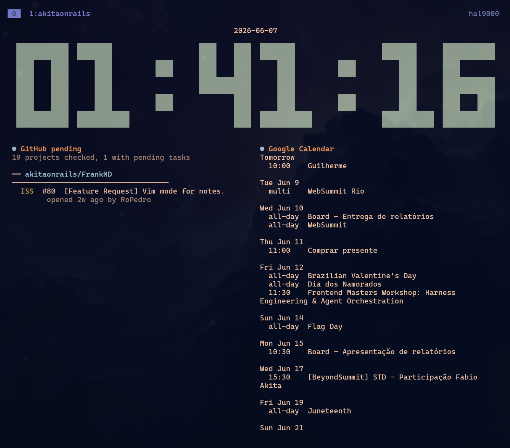

# clock-tui (`tclock`)



`tclock` is a terminal clock app with clock, timer, stopwatch, and countdown modes.

This repository is a maintained fork of the original [`race604/clock-tui`](https://github.com/race604/clock-tui). The original project appears to have been paused for a long time, so this fork keeps the core idea and modernizes it with updated Rust dependencies, GitHub release binaries, AUR packaging, and clock-mode command widgets.

## Install

### Arch Linux / AUR

The recommended install method on Arch Linux is the prebuilt AUR package from this fork:

```shell
yay -S clock-tui-bin
```

### GitHub Releases

Prebuilt Linux binaries are published for `x86_64` and `aarch64`:

<https://github.com/akitaonrails/clock-tui/releases>

Download the tarball for your architecture and put `tclock` somewhere in your `PATH`.

### Build from source

To install this fork directly from GitHub:

```shell
cargo install --git https://github.com/akitaonrails/clock-tui --package clock-tui
```

To build a local checkout:

```shell
cargo build --release
```

The binary will be at `target/release/tclock`.

## Basic usage

```shell
tclock
```

Press `q` to exit. In the main loop, press `c`, `w`, or `t` to switch to clock, stopwatch, or timer mode. Press `Space` to pause/resume modes that support pausing.

Use `--help` for all options:

```shell
tclock --help
tclock clock --help
tclock timer --help
```

## Modes

### Clock

```shell
tclock clock

# The clock is also the default mode:
tclock
```


Clock options include timezone, seconds, milliseconds, date visibility, color, and size:

```shell
tclock clock --timezone America/New_York
tclock clock --no-seconds
tclock --color '#e63946'
tclock --size 2
```

### Timer

```shell
# Start a 5-minute timer
tclock timer --duration 5m
```

Durations can use suffixes such as `s`, `m`, `h`, and `d`. Timer mode can run several durations sequentially and can execute a command when time is up:

```shell
tclock timer --duration 25m 5m --title Focus Break
tclock timer --duration 25m --execute terminal-notifier -title tclock -message "Time is up!"
```


### Stopwatch

```shell
tclock stopwatch
```


### Countdown

```shell
tclock countdown --time 2026-01-01 --title 'New Year 2026'
```

`--time` accepts values such as `2026-01-01`, `20:00`, `2026-12-25 20:00:00`, or `2026-12-25T20:00:00-04:00`.


## Configuration

`tclock` reads config from the XDG config path:

```text
$XDG_CONFIG_HOME/tclock/config.toml
```

That is usually:

```text
~/.config/tclock/config.toml
```

Missing config is ignored. Invalid TOML prints an error and falls back to defaults.

Example:

```toml
[default]
mode = "clock"
color = "green"
size = 1

[clock]
show_date = true
show_seconds = true
show_millis = false
timezone = "America/Sao_Paulo"

[timer]
durations = ["25m", "5m"]
titles = ["Focus", "Break"]
repeat = false
show_millis = true
start_paused = false
auto_quit = false
```

## Clock widgets

Clock mode can display command widgets below the clock. A widget runs a command, captures its output, renders ANSI colors/styles, and refreshes independently.

Widgets are useful for small status panels: GitHub pending work, calendars, system stats, reminders, CI state, or any command that prints useful text and exits.

The clock automatically sizes itself into the top area when widgets are configured, and the bottom area shows up to 2 widgets on square-ish terminals, 4 on wide terminals, and 6 on ultra-wide terminals.

Each widget supports:

- `title`: optional display title
- `command`: executable string, or array form with arguments
- `refresh_secs`: refresh interval, default `900`
- `timeout_secs`: command timeout, default `30`

### Screenshot example

The screenshot at the top uses the current local config from this fork, with two widget commands:

- [`ghpending`](https://github.com/akitaonrails/ghpending) for GitHub pending tasks
- [`google-calendar-tui`](https://github.com/akitaonrails/google-calendar-tui) for Google Calendar agenda output

```toml
[clock]
show_date = true

[[clock.widgets]]
title = "GitHub pending"
command = "ghpending"
refresh_secs = 900

[[clock.widgets]]
title = "Google Calendar"
command = "google-calendar-tui"
refresh_secs = 3600
```

Array commands are supported when you need arguments or a shell wrapper:

```toml
[[clock.widgets]]
title = "GPU"
command = ["nvidia-smi"]
refresh_secs = 60

[[clock.widgets]]
title = "Shell command"
command = ["sh", "-c", "printf 'hello from a widget'"]
```

Widget commands should be finite stdout-producing commands that exit. Long-running alternate-screen TUIs are not a good fit unless they also provide a command or flag that prints a snapshot and exits.

Widget output is intended for compact status text and is capped in memory; very large command outputs are truncated.

## Credits

Original project and core app by [Race604](https://github.com/race604). This fork keeps the original MIT license and continues the project with maintenance, packaging, and widget features.

## License

MIT License. See [LICENSE](./LICENSE).
