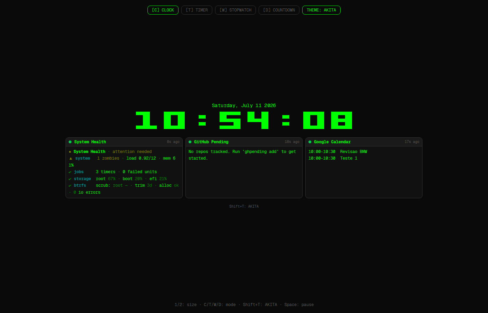
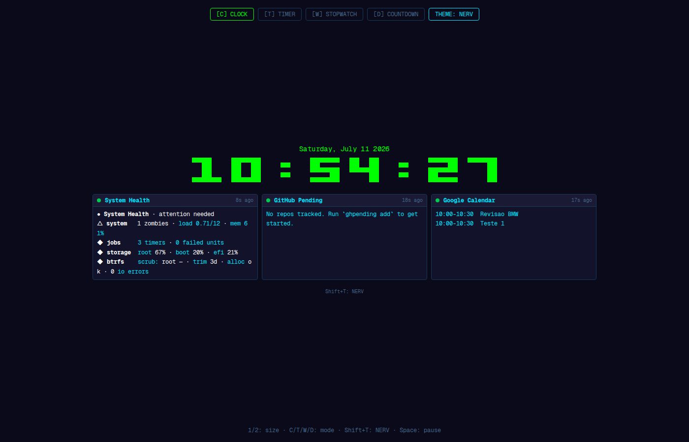
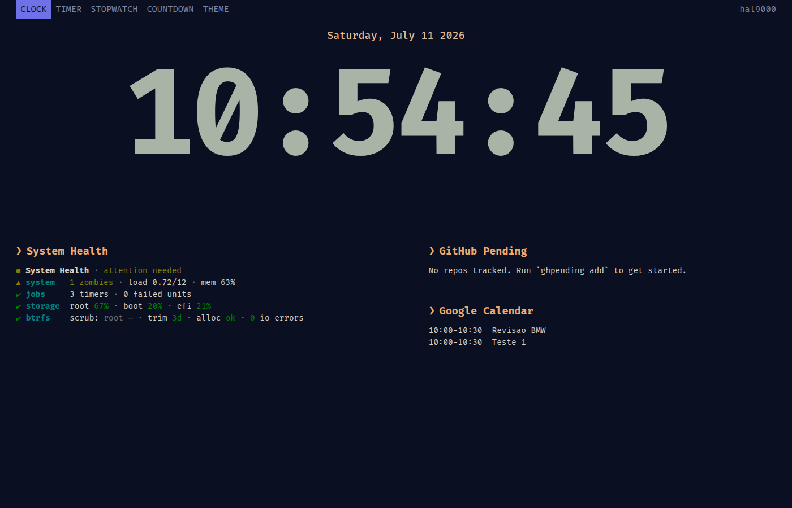

# tclock — Retro Terminal Clock (Web Edition)

A retro-styled terminal clock TUI ported from **Rust** to the **web** with Next.js. Displays the time in a custom "bricks" bitmap font (6×5 matrix), with multiple modes (clock, timer, stopwatch, countdown), live widgets (system health, GitHub pending reviews, Google Calendar events), and a full CSS variable-based theme system with **3 built-in themes**.

> **Previously**: a Rust terminal application using the `ratatui` framework.
> **Now**: a Next.js 16 web application with the same features, plus widgets and themes.

---

## Themes

Three themes, cycled with `Shift+T`:

<table>
  <tr>
    <th>AKITA</th>
    <th>NERV</th>
    <th>CLASSIC <em>(default)</em></th>
  </tr>
  <tr>
    <td></td>
    <td></td>
    <td></td>
  </tr>
  <tr>
    <td>Green-on-black bricks font, amber accents, CRT feel</td>
    <td>Evangelion-inspired cyan-on-dark, industrial terminals</td>
    <td>HAL 9000 workspace: beige-on-navy, retro header, columnar widgets</td>
  </tr>
</table>

## Features

- **Bricks font** — Custom 6×5 character matrix displayed via CSS grid, matching the original Rust renderer
- **4 clock modes** — Clock, Timer, Stopwatch, and Countdown, switchable via keyboard shortcuts
- **Live widgets** — System Health dashboard, GitHub pending PRs/reviews, Google Calendar agenda — each auto-refreshing on its own schedule
- **Theme system** — 3 built-in themes (AKITA, NERV, CLASSIC) with CSS custom properties; cycle via `Shift+T`. CLASSIC is a HAL 9000-inspired retro dashboard with window manager tabs, columnar widgets, and hostname display.
- **Keyboard-driven** — All controls available from the keyboard, no mouse required
- **Persistent config** — Settings saved to `localStorage` with versioned migration support
- **Network-accessible** — Serves on your LAN (e.g. `http://192.168.69.130:3000`), works from any device on the network
- **ANSI support** — Widget output with ANSI escape codes renders in-color in the browser

---

## Quick Start

```bash
# Install dependencies
npm install

# Start the development server
npm run dev
```

Open [http://localhost:3000](http://localhost:3000) — or your machine's LAN IP on port 3000 — to see the clock.

### Production Build

```bash
npm run build
npm start
```

---

## Usage

### Modes

| Mode | Key | Description |
|------|-----|-------------|
| Clock | `C` | Current time in bricks font, with optional date/timezone/seconds/millis |
| Timer | `T` | Countdown timer with configurable durations and repeat |
| Stopwatch | `W` | Elapsed time with pause/resume |
| Countdown | `D` | Countdown to a specific datetime |

### Keyboard Shortcuts

| Key | Action |
|-----|--------|
| `1` / `2` | Decrease / Increase font size |
| `C` | Clock mode |
| `T` | Timer mode |
| `W` | Stopwatch mode |
| `D` | Countdown mode |
| `Space` | Pause / Resume timer or stopwatch |
| `Shift+T` | Cycle widget theme |

---

## Widget System

Widgets are external scripts executed server-side via `/api/widget/run`. Each widget has its own refresh interval and time-out.

### Built-in Widgets

| Widget | Command | Description |
|--------|---------|-------------|
| System Health | `tclock-system-health` | CPU load, memory, disk usage, btrfs status, systemd units |
| GitHub Pending | `ghpending` | Pending PRs and reviews from GitHub |
| Google Calendar | `tclock-gcalcli --military` | Upcoming calendar events in 24h format |

### System Health Widget

A bundled bash script at `examples/widgets/tclock-system-health` that renders a compact ANSI dashboard:
- CPU load / memory usage
- Per-filesystem disk usage
- Btrfs scrub age, fstrim status, device I/O errors
- Systemd failed units and user timer status
- Zombie process count

### GitHub Pending Widget

Requires the `ghpending` CLI tool ([GitHub](https://github.com/akitaonrails/ghpending)) installed on the server:

```bash
cargo install ghpending
```

Configure with `~/.config/ghpending/config.toml`:

```toml
github_token = "your_github_token"
```

### Google Calendar Widget

See [Google Calendar Setup](#google-calendar-setup) below.

### Adding Widgets

Widgets are configured through the app — edit the default config in [lib/config.ts](lib/config.ts) under `clock.widgets`:

```ts
{
  title: 'My Widget',
  command: 'my-widget-command --flag',
  position: 'auto',       // 'auto' or 'bottom'
  refresh_secs: 300,      // refresh every 5 minutes
  timeout_secs: 30,       // kill after 30 seconds
}
```

---

## Theme System

Three built-in themes, cycled with `Shift+T`:

| Theme | Default | Description |
|-------|---------|-------------|
| **AKITA** | ✓ | Green-on-black, amber accents, CRT scanline feel — the original terminal look |
| **NERV** | | Evangelion-inspired: cyan terminals on dark industrial blue |
| **CLASSIC** | | HAL 9000 workspace: beige-on-navy, retro window manager header with tabs, columnar widget layout, hostname display |

The default theme on a fresh install is **CLASSIC** — the HAL 9000-inspired retro dashboard. The theme persists in localStorage across sessions.

Themes are applied as CSS custom properties on `document.documentElement`. See [lib/themes.ts](lib/themes.ts) for the full variable list and to add your own.

### CSS Variables Exposed

```css
--bg              /* Page background */
--fg              /* Primary text */
--fg-dim          /* Dimmed text (borders) */
--muted           /* Muted text */
--surface         /* Card/panel background */
--surface-alt     /* Card title bar background */
--border-color    /* Default border */
--border-radius   /* Border radius */
--font-mono       /* Monospace font stack */
--section-title-color  /* Widget section titles */
--danger          /* Error/danger color */
```

---

## Google Calendar Setup

The Google Calendar widget uses a Python wrapper that reads OAuth credentials from `~/.local/share/gcalcli/oauth.json`.

### Prerequisites

```bash
pip install google-api-python-client google-auth-oauthlib
```

### Setup Steps

1. Go to [Google Cloud Console](https://console.cloud.google.com/apis/credentials)
2. Create an OAuth 2.0 Client ID (Desktop app type)
3. Download the credentials JSON
4. Save as `~/.local/share/gcalcli/oauth.json`
5. Run the widget once to authorize:

```bash
tclock-gcalcli --military
```

The first run opens a browser for OAuth consent; the resulting token saves alongside the credentials file.

> **Note**: The widget uses `tclock-gcalcli`, a Python wrapper that reads `~/.local/share/gcalcli/oauth.json` and uses the Google Calendar API directly — not the `gcalcli` CLI tool.

---

## Configuration

All settings are stored in `localStorage` under the key `tclock-config`. The config schema has a `_version` field; when the version changes, saved widget configs reset to defaults while other settings are preserved via deep-merge.

See [lib/config.ts](lib/config.ts) for the full schema and defaults.

### Config Version History

| Version | Change |
|---------|--------|
| 1 | Initial |
| 2 | Widget command format updated |
| 3 | Google Calendar: switched from gcalcli to tclock-gcalcli |
| 5 | Theme rename: AKITA → NERV → CLASSIC with HAL 9000 retro dashboard |
| 6 | Fix: hydration errors, theme cycling with CLASSIC default |
| 7 | Widget theme passthrough: retro themes mapped to default for CLI commands |
| 8 | Force widget_themes to 3 entries, clamp theme index |

---

## Architecture

```
app/
├── layout.tsx            # Root layout, metadata, CSS variable background
├── page.tsx              # Main page with searchParams mode routing
├── globals.css           # CSS custom properties and theme defaults
└── api/widget/run/
    └── route.ts          # API route: executes widget commands server-side

components/
├── ClockApp.tsx          # Main app shell: keyboard handler, mode dispatch, theme
├── ClockDisplay.tsx      # Clock mode: time display + widget panel
├── TimerDisplay.tsx      # Timer mode
├── StopwatchDisplay.tsx  # Stopwatch mode
├── CountdownDisplay.tsx  # Countdown mode
├── BricksText.tsx        # Bricks font renderer (CSS grid)
├── WidgetPanel.tsx       # Widget grid: auto/bottom layout, fetch cycles, ANSI render

lib/
├── config.ts             # Config types, defaults, localStorage persistence, versioned migration
├── themes.ts             # Theme definitions (3 themes) and CSS variable application
├── bricks.ts             # Character matrix definitions (ported from Rust bricks.rs)
├── ansi.tsx              # ANSI escape code parser + React component renderer
├── clock.ts              # Clock logic (time formatting)
├── modes.ts              # Duration formatting helpers
├── timer.ts              # Timer logic
├── stopwatch.ts          # Stopwatch logic
├── countdown.ts          # Countdown logic

hooks/
├── useTimer.ts           # Timer hook
├── useStopwatch.ts       # Stopwatch hook
└── useCountdown.ts       # Countdown hook
```

### Key Decisions

- **Client components** — All interactive components use `"use client"` for timers and browser APIs (localStorage, ResizeObserver)
- **URL-based mode** — Clock mode is driven by `?mode=clock` searchParams, preserving the URL-as-state pattern
- **Widgets as CLI commands** — Widget scripts run server-side via `child_process.execFile`, so output is always from the machine hosting the app; no browser-side execution
- **No React state library** — The app is small enough that `useState`/`useRef`/`useCallback` suffice; no Redux or Zustand
- **CSS variables for theming** — Themes are applied by setting CSS custom properties, not by swapping stylesheets; makes runtime theme changes instant

---

## Development

```bash
# Start dev server with Turbopack
npm run dev

# Lint
npm run lint

# Type check
npx tsc --noEmit
```

The app uses:
- **Next.js 16** with Turbopack and the App Router
- **Tailwind CSS** for utility classes (minimal — most styling is via CSS variables)
- **Geist Mono** font (Vercel's monospace font, matches the terminal aesthetic)
- **No external state management** or CSS-in-JS libraries

---

## License

MIT License — see [LICENSE](LICENSE).

---

## Acknowledgements

- Original [clock-tui](https://github.com/akitaonrails/clock-tui) by [akitaonrails](https://github.com/akitaonrails) — the Rust TUI that inspired this web port
- [ghpending](https://github.com/akitaonrails/ghpending) — Rust CLI for GitHub pending reviews
- [Geist Mono](https://vercel.com/font) by Vercel
